# mini toto（サッカーくじ）の結果予測アプリケーション
mt(mini toto) prophetは、mini totoの試合結果を予測するアプリケーションです。 
過去の試合結果をもとに、チーム別のレーティングを算出します。 
算出したレーティングをもとに、次節の試合結果を予測する機能を提供します。  

# 本アプリケーションの作成背景
知人がプログラミング学習をしたいとの要望あり、作成したアプリケーションです。 
JavaやSpringBootを利用したWEBアプリケーションを学ぶにあたり、SpringBootを用いた 
基本的な3層モデルや、データベースに対するCRUD操作を機能として盛り込んでいます。 
また知人の興味があったWEBスクレイピングや、レーティング計算機能を実装しています。 

# 機能一覧

本アプリケーションで提供する機能は下記の通りです。

1. データ収集（試合結果、チーム情報）
1. レーティング計算
1. くじ結果予測
1. ヒストグラム設定

## 1.データ収集（試合結果、チーム情報）

### 試合結果の収集
- 試合結果は年度を指定するか、すべての試合結果の取得を選択可能です。 
取得した試合結果をデータベースに保存します。

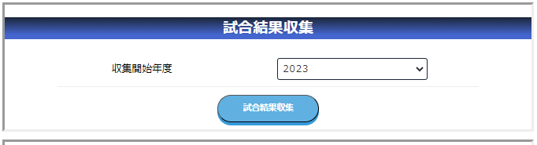
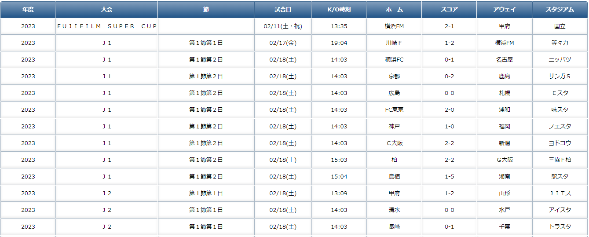

### チーム情報の収集
- チーム情報はJリーグに存在するすべてのチームを対象に取得します。 
取得した試合結果をデータベースに保存します。

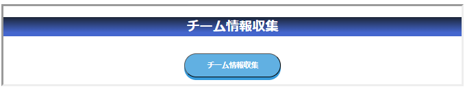
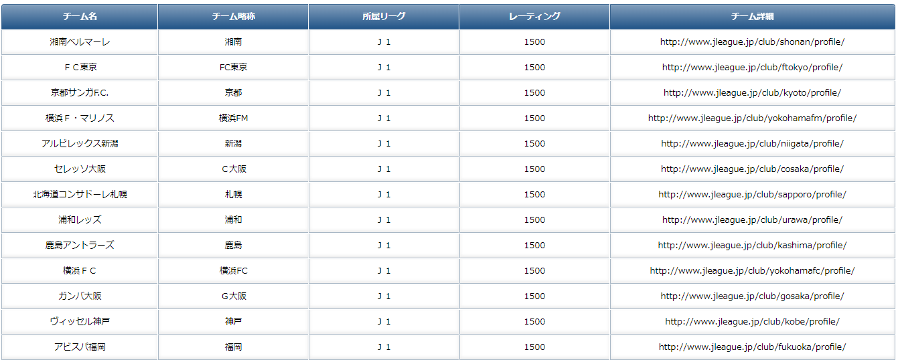

## 2.レーティング計算

- 収集した過去の試合結果情報をもとに、レーティング計算を行います。 
オプションで繰り返し回数を指定し、直近年度に重みをつけた計算も可能です。

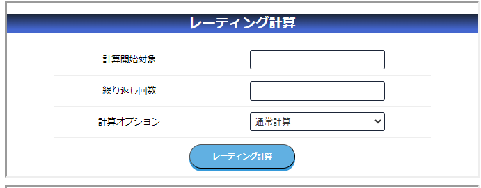
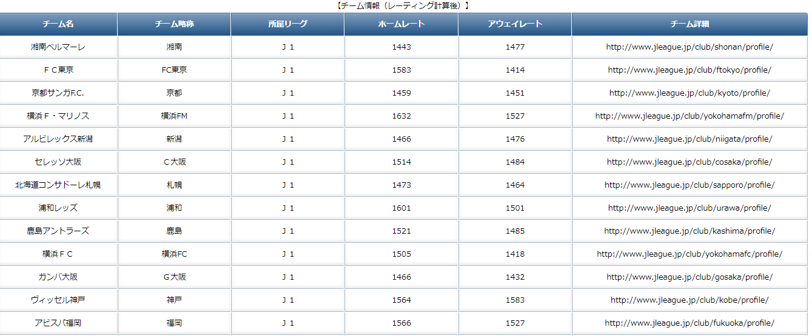

- レーティングはホームかアウェイかによって期待勝率が異なるため、それぞれで算出をしています。

## 3.くじ結果予測

- マッチングしたチーム同士のレーティングと、後述するヒストグラムをもとに、 
mini totoくじの購入の組み合わせごとに当選確率を予測します。

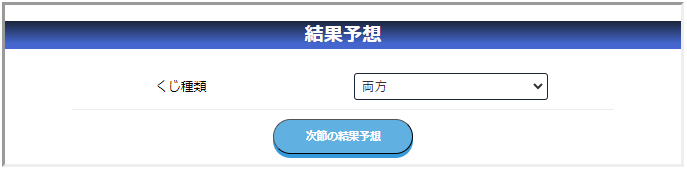
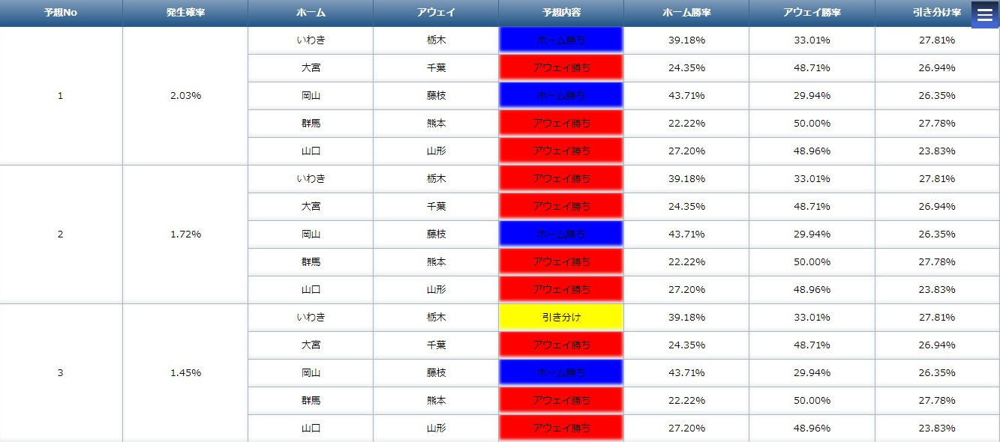

## 4.ヒストグラム設定

- 予測の基礎情報としてヒストグラムを設定します。レート差ごとに、勝ち、負け、引き分けの確率を定義します。 
マッチングにおけるレート差をこの表に当てはめて、くじ結果予測を行います。 
製作時点の過去の試合結果から導出したものを利用していますが、任意値に変更も可能です。 

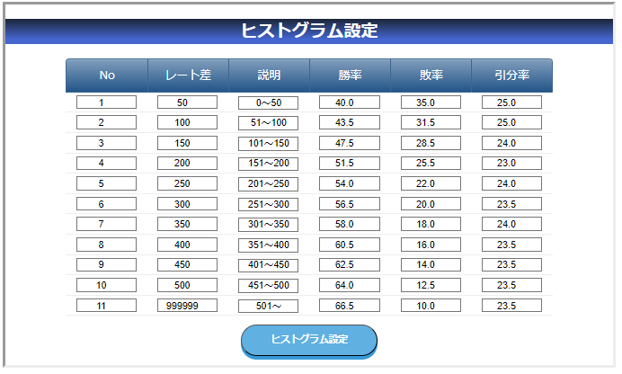

## その他
- メインメニュー

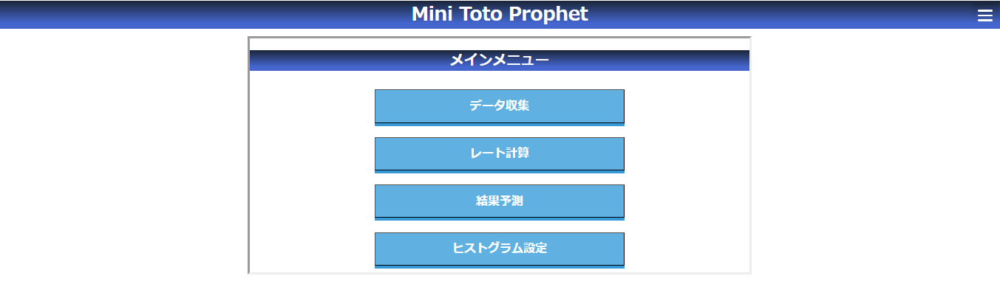

- サイドメニュー

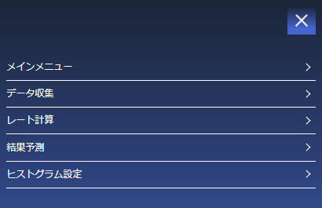

# 使用技術

## フロントエンド
- HTML
- CSS
- JavaScript
- JQuery
- Thymeleaf

## バックエンド
- Java 17
- SpringBoot 3.0.5
- MySQL 8.0.17
- selenium-java 4.5.3
- webdriver-manager 5.3.0

## その他（開発ツールなど）
- Docker（開発環境におけるDBのコンテナとして利用）
- POM
- Git
- Eclipse Version: 2023-03 (4.27.0)
- A5:SQL Mk-2

# 参考：スクレイピング対象サイト
[J.League Data Site](https://data.j-league.or.jp/)  
[スポーツくじ「big」 目指せ高額当せん だれでも億万長者のチャンス](https://store.toto-dream.com/dcs/subos/screen/ps01/spsl000/PGSPSL00001MoveTotoLoto.form)  
本アプリケーションは、上記対象サイトが2023年7月時点でのウェブページに対応しています。 
それ以降のウェブページ更新には未対応のため、現在は動作しない可能性があります。 